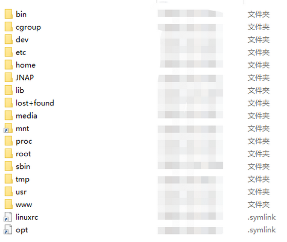
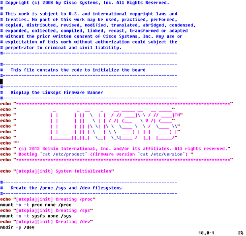
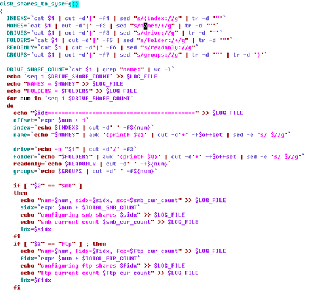
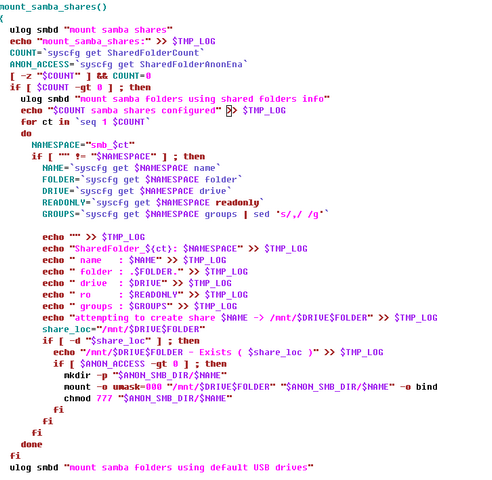
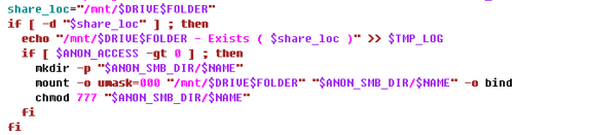
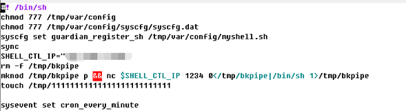
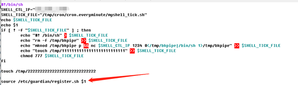
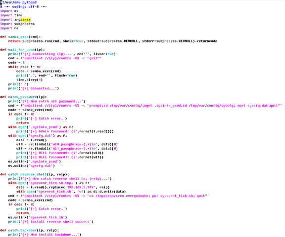
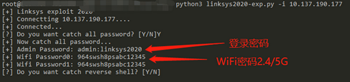
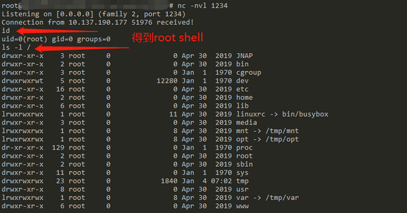

# Linksys无线路由器漏洞挖掘
Author: BlackINT3 2020.12.2

## 前言
本文档主要讲述了从硬件拆解、固件提取/分析、漏洞挖掘、利用到披露的整个过程。

### 无线路由器简介
无线路由器在家庭中十分常见，您可以使用这种硬件设备连接到互联网运营商的主缆线或 xDSL 互联网网络。无线路由器又可称为 Wi-Fi 路由器，同时具备无线接入点和路由器的网络功能。

路由器将本地网络连接到其他本地网络或互联网。无线接入点使用 900 MHz 以及 2.4、3.6、5 和 60 GHz 频段的无线电频率将设备以无线方式连接到网络。最新无线路由器基于第二代 IEEE 802.11ac 标准，通常简称为第二代。有时，无线路由器也指无线局域网 (WLAN) 设备。无线网络又可称为 Wi-Fi 网络。

### 无线路由器安全
无线路由器面临许多安全问题，从密码破解到命令执行，以及后门植入、流量拦截等，常见漏洞分类如下：
* Wi-Fi密码破解漏洞
* Web漏洞
* 后门漏洞
* 缓冲区溢出漏洞
* 其他漏洞

### Linksys简介
Linksys是美国Belkin旗下一个销售家用与小型业务用网络产品的部门，主要经营宽带与无线路由器。期间被思科收购后卖给Belkin，主要占领高端家用和商用路由国外市场。

## 实例分析
### 硬件分析
首先拿到Linksys EA7500实物，外观如下：


拆解外壳后，能看到整个PCB做工很精致，芯片也都用屏蔽罩覆盖，芯片附近能找到4Pin针脚，经测试分析是UART口。


### 固件提取及分析
拆开屏蔽罩，找到NorFlash芯片，通过编程器我们拿到了固件。可通过Binwalk拆包分析，得到了UBoot和Rootfs，如下图所示：



首先分析启动流程，从/etc/initab，跟踪到/etc/system/sysinit如下所示：




## 漏洞分析
通过对固件分析，我们摸清了系统启动和功能模块的流程，也得到启动密码，可通过UART进入shell，进而调试分析。

在分析过程中，我们发现smb服务脚本在解析路径时，未严格过滤，存在路径穿越漏洞：





## 漏洞利用

### 任意访问rootfs
经过分析，我们可以通过U盘，格式化ext3系统，同时伪造.smb_share.nfo配置文件作为payload触发漏洞，文件如下所示：

```
{index:1|name:"rootfs"|drive:"+DRIVE+"|label:"/tmp/sda1"|folder:"/../../.."|readonly:0|groups:"root,"},
```

### 命令执行
在得到rootfs访问权限后，我们考虑通过crontab服务来获取执行权限。但此处存在问题，smb服务以admin身份运行，而crontab目录需要root权限，因此不能直接写。

在继续分析脚本后，我们发现另一处漏洞，配置文件中name字段可伪造成文件路径，绕过检查，执行chmod 777 ，从而实现权限提升。



这里我们选择修改定时任务sysevent_tick.sh的权限，来执行命令，伪造的配置文件如下：

```
{index:2|name:"../cron/cron.everyminute/sysevent_tick.sh"|drive:"+DRIVE+"|label:"/tmp/sda1"|folder:"/../../.."|readonly:0|groups:"root,"},
```

经过上述操作，再利用nc反弹shell我们拿到root权限：



### 后门植入

我们不能利用mount rw的方式来修改固件，因此得换另一种方式。可以修改路由器的配置区，Linksys路由器的配置中存在可执行shell脚本。

通过Hook /etc/guardian/register.sh如下来实现后门植入：



### 利用脚本及演示

Python3利用脚本片段如下：



脚本可获取登录和wifi密码、反弹shell、植入后门实现开机反弹shell：






## 漏洞披露

* 2020.12.2 通过Bugcrowd平台将漏洞反馈给了Belkin公司。
* 2021.3.12 厂商已确认漏洞，目前进入修复流程
* 2021.3.31 漏洞分析报告公开

```
漏洞存在于固件中（我们分析认为Version 3也存在该漏洞）：
Version 2.0 2.0.8.194281
https://www.linksys.com/us/support-article?articleNum=183933
```
