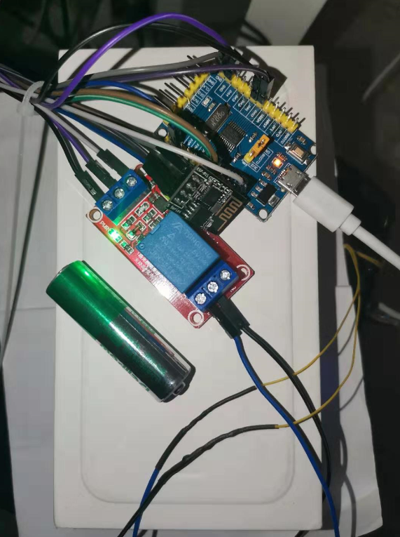
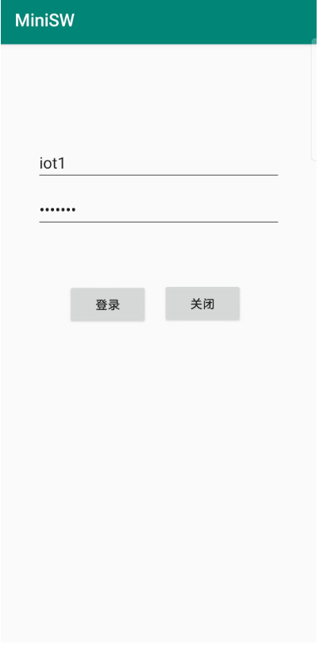
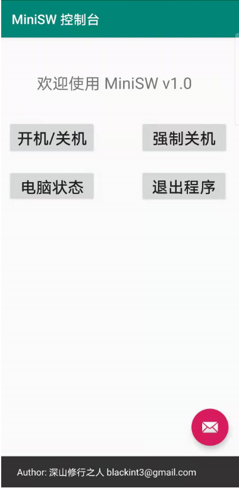

# IoT实践--电脑远程开关的制作

Author：BlackINT3 2020.1.24

看雪链接：https://bbs.pediy.com/thread-257373.htm

### 前言
想远程家里电脑，又不想一直开着浪费电。试过WOL（局域网唤醒）的方案不太靠谱，一来唤醒可能会失败，二来电脑如果蓝屏/卡机没法强制关机。于是想到了单片机来控制，至于控制部分，考虑过机械臂，但成本太高，通过步进电机制作又略显麻烦。后面想到了个简单的方案，通过短接PWR-SW开机键两端，产生开机触发信号即可模拟开机动作。所以就有了本文这个东西，文章写得有些琐碎，留个纪念吧。



### 硬件部分
硬件属于本文重点，虽然原理比较简单，但相对软件，需要准备的东西较多，都可以在X宝买，有些商家为了堆销量1块钱都包邮。

##### 基本原理
STM32板子利用ESP8266模块的WiFi功能连接路由（和Web服务端处于同一个内网），然后定时轮询Web服务器，获取指令（开机/关机、强制关机），得到指令后STM32板子操作GPIO，控制继电器开闭，从而控制PWR-SW开机键闭合。

##### 硬件准备
* MCU：STM32F030F4 Cortex-M0入门级，¥6块多。之前用的F103开发板，后面觉得功耗较高、功能过剩，就买了一块F0最小系统。（还不是因为穷）。
* 继电器：1路5v光耦隔离的即可。
* WiFi模块：ESP8266-01s（出厂一般都是刷了固件的，我之前用Arduino把固件写坏了，后面重刷了一次，也顺带升级了版本）
* USB转UART下载器（可选）：可用USART烧录程序。
* JLink仿真器（可选）：支持SWD，可用SWD烧录程序。
* 杜邦线：公对公/公对母/母对母若干根。
* 烙铁、助焊剂（焊膏/松香）、焊锡备用。
* 热缩管：包扎飞线和杜邦线的接线处。
* 飞线：接电脑开机键两端。

##### 电路接线
* 拆下电脑前端面板，用飞线连接开机键两端（无需焊接，捆住固定即可）。飞线出来的两端连接到继电器（可通过杜邦线间接连接）。
* 买到的STM32F030F4板子有两块引脚排针，需要自己焊上去，当然你也可以买焊好的。
* 板子需要5v Micro USB电源线，可用普通充电头（我是直接用的电脑USB口，关机状态下提供电源，需要在BIOS里设置）
* 板子PA1连接到继电器作为电平输入，同时连接5V引脚和共地。
* JLink接线([查看JLink接线](resources/images/JLink连线.png))，UART接线按常规连接TX/RX/GND即可。
* ESP8266的TX和RX分别连接PA9和PA10，同时连接3.3V引脚和共地，PA0连接RST用于复位。模块启动时CH-EN引脚默认高电平，因此无需使能。

##### 开发环境
* Keil5：例如安装5.29。[KeyGen下载](http://www.openedv.com/forum.php?mod=viewthread&tid=275700)
* 安装STM32F0开发包：[Keil.STM32F0xx_DFP.2.0.0.pack](https://keilpack.azureedge.net/pack/Keil.STM32F0xx_DFP.2.0.0.pack)，建议用迅雷下载。
* 配置烧录和调试器：Flash--Configure Flash Tools--Debug--选择JLink，然后设置，没问题的话能SW Device里看到JLink的设备，最后选择Flash Download把STM32F0xx的烧录信息添加进去，例如STM32F0xx 16KB Flash，地址范围0x08000000~(+0x00004000)。然后勾选Reset and Run(下载后运行)。
* 配置编译，优化选择O1（O0生成的文件超出了Flash的容量）。

#### 代码实现
因为工程比较简单，也写了注释，所以我将代码全部放入main.c中便于阅读。程序首先初始化定时器以及各外设，连接WiFi后开始轮询获取服务端数据，通过解析数据来设置PA1端口的高低电平，进而控制继电器闭合。
* 初始化定时器
```
//接收数据定时器
TIM1_Init(50);

//接收超时定时器
TIM3_Init(5000);

//轮询定时器
TIM14_Init(3000);
```
* 初始化ESP8266，控制WiFi
```
void WiFi_Init()
{
	GPIO_InitTypeDef GPIO_InitStruct;
	RCC_AHBPeriphClockCmd(RCC_AHBPeriph_GPIOA, ENABLE);
	GPIO_InitStruct.GPIO_Pin = GPIO_Pin_0;
	GPIO_InitStruct.GPIO_Speed = GPIO_Speed_10MHz;
	GPIO_InitStruct.GPIO_Mode = GPIO_Mode_OUT;
	GPIO_InitStruct.GPIO_OType = GPIO_OType_PP;	
	GPIO_Init(GPIOA, &GPIO_InitStruct);
	RESET_IO(1);
}
char WiFi_Start()
{
	//复位
	if (WiFi_Reset(50)) {
		return 1;
	}
	//设置STA模式
	if (WiFi_SendCmd("AT+CWMODE=1",50)) {
		return 1;
	}
	//取消自动连接
	if (WiFi_SendCmd("AT+CWAUTOCONN=0",50)) {
		return 1;
	}
	//开始连接
	if (WiFi_Connect(30)){
		return 1;
	}
	//开启透传
	if(WiFi_SendCmd("AT+CIPMODE=1",50)){
		return 1;
	}
	//关闭多路连接
	if(WiFi_SendCmd("AT+CIPMUX=0",50)){
		return 1;
	}
	return 0;
}
```
* 初始化USART
```
void USART1_Init(unsigned int baud)
{  	 	
	GPIO_InitTypeDef GPIO_InitStruct;
	USART_InitTypeDef USART_InitStructure;
	NVIC_InitTypeDef NVIC_InitStruct;
	
	RCC_AHBPeriphClockCmd(RCC_AHBPeriph_GPIOA, ENABLE);
	RCC_APB2PeriphClockCmd(RCC_APB2Periph_USART1, ENABLE);
	
	//设置PA9/PA10作为TX/RX端口
	GPIO_PinAFConfig(GPIOA, GPIO_PinSource9, GPIO_AF_1);
	GPIO_PinAFConfig(GPIOA, GPIO_PinSource10, GPIO_AF_1);

	GPIO_InitStruct.GPIO_Pin = GPIO_Pin_9 | GPIO_Pin_10;
	GPIO_InitStruct.GPIO_Mode = GPIO_Mode_AF;
	GPIO_InitStruct.GPIO_Speed = GPIO_Speed_50MHz;
	GPIO_InitStruct.GPIO_OType = GPIO_OType_PP;
	GPIO_InitStruct.GPIO_PuPd = GPIO_PuPd_UP;
	GPIO_Init(GPIOA, &GPIO_InitStruct);
	
	USART_InitStructure.USART_BaudRate = baud;
	USART_InitStructure.USART_WordLength = USART_WordLength_8b;
	USART_InitStructure.USART_StopBits = USART_StopBits_1;
	USART_InitStructure.USART_Parity = USART_Parity_No;
	USART_InitStructure.USART_HardwareFlowControl = USART_HardwareFlowControl_None;
	USART_InitStructure.USART_Mode = USART_Mode_Rx | USART_Mode_Tx;

	USART_Init(USART1, &USART_InitStructure);		
	USART_ITConfig(USART1,USART_IT_RXNE,ENABLE);
	USART_Cmd(USART1, ENABLE);
	
	NVIC_InitStruct.NVIC_IRQChannel = USART1_IRQn;
	NVIC_InitStruct.NVIC_IRQChannelPriority = 0x02;
	NVIC_InitStruct.NVIC_IRQChannelCmd = ENABLE;
	NVIC_Init(&NVIC_InitStruct);
}
```
* 初始化GPIO，控制继电器
```
void RelayIO_Init()
{
	GPIO_InitTypeDef GPIO_InitStruct;
	RCC_AHBPeriphClockCmd(RCC_AHBPeriph_GPIOA, ENABLE);
	GPIO_InitStruct.GPIO_Pin = GPIO_Pin_1;
	GPIO_InitStruct.GPIO_Speed = GPIO_Speed_10MHz;
	GPIO_InitStruct.GPIO_Mode = GPIO_Mode_OUT;
	GPIO_InitStruct.GPIO_OType = GPIO_OType_PP;	
	GPIO_Init(GPIOA, &GPIO_InitStruct);
	//默认低电平，高电平闭合
	RESET_BUTTON(0);
}
```
* 轮询服务器
```
//根据实际情况配置
#define ACCESS_KEY "Basic aW90MTpwYXNzd2Qx" //base64(iot1:passwd1)
#define SSID   	   "****"
#define PASSWORD   "****"
#define SERVER_IP  ""
#define SERVER_PORT 0

//构造HTTP请求开关数据
void WiFi_MiniSW_Status()
{
	char temp[128];
	memset(TXbuff,0,sizeof(TXbuff));
  memset(temp,0,sizeof(temp));                                         
	sprintf(TXbuff,"GET /minisw/ HTTP/1.1\r\n");
	sprintf(temp,"Authorization:%s\r\n",ACCESS_KEY);
	strcat(TXbuff,temp);
	strcat(TXbuff,"Host:www.aaabbbccc.com:30000\r\n\r\n");
}

//连接服务器
if (!WiFi_Connect_Server(50)) {
    //连接成功，Http请求数据
    WiFi_RxCounter = 0;
    memset(WiFi_RxBuff,0,WiFi_RxBuff_Size);
    Conn_Status = 1;
    WiFi_MiniSW_Status();
    WiFi_Input(TXbuff);
    TIM_Cmd(TIM3, ENABLE);
} else {
    //失败重置
    TIM_Cmd(TIM3, DISABLE);
    TIM_Cmd(TIM14, DISABLE);
    Conn_Status = 0;
    Reset_Status = 1;
    Poll_Status = 0;
}
```

* 解析返回数据，控制继电器闭合
```
//时间戳改变，说明控制命令有更新
if (memcmp(ts, sw_ts, sizeof(ts))) {
    if (sw_ts[0] != '\0') {
        presult = strstr(json,"\"act\": "); 
        if(presult!=NULL){
            if(*(presult+7) == '1') {
                //闭合1s，实现关机或开机
                PRESS_BUTTON();
                Delay_Ms(1000);
                RELEASE_BUTTON();
            } else {
                //闭合5s，实现强制关机(重复5次，这样写是防止用5000导致溢出结果不准确)
                PRESS_BUTTON();
                Delay_Ms(1000);
                Delay_Ms(1000);
                Delay_Ms(1000);
                Delay_Ms(1000);
                Delay_Ms(1000);
                RELEASE_BUTTON();
            }
        }									
    }
}
```
### 服务端
服务端使用Python 3.7开发，个人比较喜欢小巧的[webpy框架](https://webpy.org/)。

##### 环境准备
* 安装virtualenv：pip install virtualenv
* 创建：virtualenv --no-site-packages minisw_web
* 激活：call minisw_xxx/Scripts/activate.bat (Windows) source minisw_web/bin/activate (Linux)
* 安装webpy：pip install web.py
* 程序运行：python minisw_web.py [监听端口]

##### 交互接口
* 登录接口：HTTP Basic认证，只需验证密码正确与否。
* 查询接口：读取数据，返回当前状态
* 更新接口：写入数据，返回操作结果

#### 代码实现
需求简单无需考虑性能和并发，因此省了很多东西，干脆连数据库都不用了，直接上一个pickle序列化作为存储即可，协议字段如下：
```
{
    'pc':1,         //机器id(保留)
    'act':1,        //0：强制关机 1：开机/关机
    'ts':15212121   //时间戳
}
```

下面是完整代码实现：
```
#!/usr/bin/env python3
# -*- coding: utf-8 -*-

import web
import re
import base64
import json
import pickle
import time

URLS = (
    '/minisw/?', 'minisw'
)

allowed = (
    ('iot1','passwd1'),
    ('iot2','passwd2')
)

web.config.debug = False

DB_FILE = 'minisw.db'

class minisw:
    def update(self, args):
        try:
            f = open(DB_FILE, 'wb')
            print(args)
            act = int(args.act)
            pc = int(args.pc)
            ts = str(int(time.time()))
            if pc == 1:
                kv = {'pc':pc, 'act':act, 'ts':ts}
                pickle.dump(kv, f)
                return 'succ'
        except Exception as e:
            print(e)
        finally:
            if f:
                f.close()
        return 'err'

    def pick(self):
        try:
            f = open(DB_FILE, 'rb')
            kv = pickle.load(f)
            print(kv)
            act = kv['act']
            pc = kv['pc']
            ts = kv['ts']
            rsp = {'pc':pc, 'act':act, 'ts':ts}
            return str(json.dumps(rsp))
        except Exception as e:
            print(e)
        finally:
            if f:
                f.close()
        return 'err'

    def accept(self, args):
        print(args)
        if len(args.keys()) == 0:
            return self.pick()
        return self.update(args)

    def GET(self):
        auth = web.ctx.env.get('HTTP_AUTHORIZATION')
        authreq = False
        if auth is None:
            authreq = True
        else:
            auth = re.sub('^Basic ','',auth)
            username,password = str(base64.b64decode(auth), 'utf-8').split(':')
            if (username,password) in allowed:
                return self.accept(web.input())
            else:
                authreq = True
        if authreq:
            web.header('WWW-Authenticate','Basic realm="Auth example"')
            web.ctx.status = '401 Unauthorized'
            return

    def POST(self):
        return '0'

def main():
    app = web.application(URLS, globals())
    app.run()

if __name__ == '__main__':
    main()

```


### 手机端
同样为了简化，没考虑跨平台，直接用Java写了个Android程序，总共两个Activity，一个登录，一个控制台，截图如下：




接下来说下开发过程：

##### 环境搭建
* 从官网下载Android Studio最新版，例如
[3.5.3](https://dl.google.com/dl/android/studio/install/3.5.3.0/android-studio-ide-191.6010548-windows.exe) （截止2020年1月）。
* 准备梯子，设置好代理(File--Settings--Http Proxy)。
* 下载安装SDK，推荐安装4.4到10.0，一劳永逸。

##### 代码实现
* 使用OkHttp3访问服务端接口，实现对应的功能，Android 9使用HTTP需要配置network_security_config.xml。
* 代码也比较简单，主要是一些按钮对应功能的实现。

部分代码片段
```
public class GlobalData {
    //服务端地址
    public static String authUrl = "http://www.aaabbbccc.com:30000/minisw/";

    public static OkHttpClient buildBasicAuthClient(final String name, final String password) {
        return new OkHttpClient.Builder().authenticator(new Authenticator() {
            private int responseCount(Response response) {
                int result = 0;
                while ((response = response.priorResponse()) != null) {
                    result++;
                }
                return result;
            }
            @Override
            public Request authenticate(Route route, Response response) throws IOException {
                if (responseCount(response) >= 1) {
                    System.out.println("认证失败，返回null");
                    return null;
                }
                String credential = Credentials.basic(name, password);
                return response.request().newBuilder().header("Authorization", credential).build();
            }
        }).connectTimeout(2, TimeUnit.SECONDS).readTimeout(2, TimeUnit.SECONDS).build();
    }

    public static class AuthRequest implements Callable<String>{
        private String username;
        private String password;
        private String url;

        public AuthRequest(String user, String passwd, String url) {
            this.username = user;
            this.password = passwd;
            this.url = url;
        }

        public String call() throws Exception {
            OkHttpClient client = GlobalData.buildBasicAuthClient(username, password);
            Request request = new Request.Builder()
                    .url(url)
                    .build();
            Response response = client.newCall(request).execute();
            if (!response.isSuccessful()) throw new IOException("Unexpected code " + response);
            return response.body().string();
        }
    };

    public static String AuthGet(String url, String username, String password) {
        try {
            FutureTask<String> ftask = new FutureTask<String>(new GlobalData.AuthRequest(username, password, url));
            Thread t = new Thread(ftask);
            t.start();
            t.join();
            String res = ftask.get();
            return res;
        } catch (Exception e) {
            return "err";
        }
    }
}
```