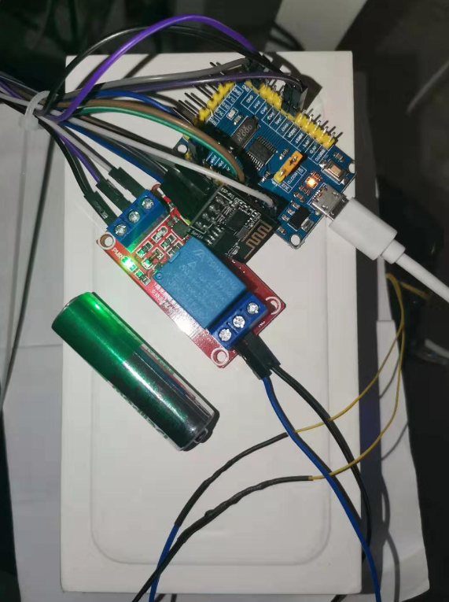
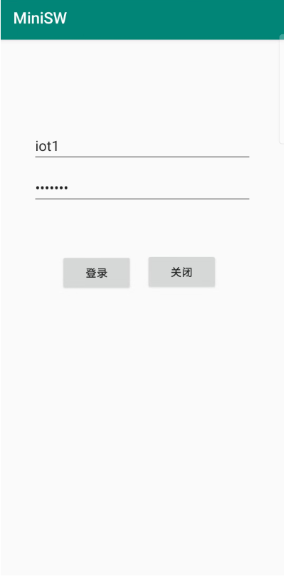
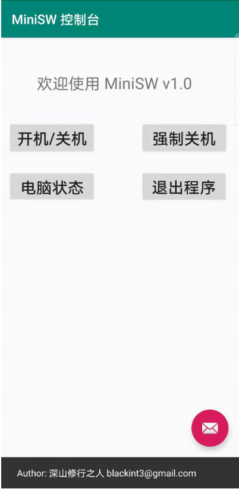

# IoT实践--电脑远程开关的制作

### 前言
* 成品图

### 硬件部分
硬件属于本文重点部分，虽然原理比较简单，但是相对软件部分，前期准备东西较多。首先看一下成品图：



##### 基本原理
STM32板子利用ESP8266连接路由，和Web服务端处于同一个内网，定时轮询Web服务器，获取指令（开机/关机、强制关机），得到指令后STM32板子操作继电器，实现开闭，继电器两端

##### 硬件准备
* MCU：STM32F030F4 Cortex-M0入门级，¥6块多。之前用的F103开发板，后面觉得功耗较高、功能过剩，就买了一块F0最小系统。（还不是因为穷）。
* 继电器：1路5v光耦隔离的即可。
* WiFi模块：ESP8266-01s（买的时候一般都是刷了固件的，我之前用Arduino的时候把固件写坏了，后面升级版本重刷了一次）
* USB转UART下载器（可选）：可用USART烧录程序。
* JLink仿真器（可选）：支持SWD，可用SWD烧录程序([查看JLink接线](resources/images/JLink连线.png))。
* 杜邦线：公对公/公对母/母对母若干根。
* 烙铁、助焊剂（焊膏/松香）、焊锡备用。
* 热缩管：一包备用，包扎飞线和杜邦线头。
* 飞线：一圈备用，接电脑开机按钮两端。

##### 电路接线
* 买到的STM32F030F4有两块排针，需要自己焊上去，当然你也可以买焊好的。
* 是

##### 开发环境
* Keil5：例如安装5.29。[KeyGen下载](http://www.openedv.com/forum.php?mod=viewthread&tid=275700)
* 安装F0的开发包：[Keil.STM32F0xx_DFP.2.0.0.pack](https://keilpack.azureedge.net/pack/Keil.STM32F0xx_DFP.2.0.0.pack)，建议用迅雷下载。
* 配置烧录和调试器：Flash--Configure Flash Tools--Debug--选择JLink，然后设置，没问题的话能SW Device里看到JLink的设备，最后选择Flash Download把STM32F0xx的烧录信息添加进去，例如STM32F0xx 16KB Flash，地址范围0x08000000~(+0x00004000)。然后勾选Reset and Run(下载后运行)。
* 配置编译，优化选择O1（O0生成的文件超出了Flash的容量）。

#### 代码实现
因为工程比较简单，所以代码全部放入main.c中便于阅读。程序首先初始化定时器以及各外设，接着轮询获取服务端数据，设置PA1端口的高低电平来控制继电器。
* 初始化定时器
```
//接收数据定时器
TIM1_Init(50);

//数据超时定时器
TIM3_Init(5000);

//轮询定时器
TIM14_Init(3000);
```
* 初始化ESP8266，控制WiFi
```
void WiFi_Init()
{
	GPIO_InitTypeDef GPIO_InitStruct;
	RCC_AHBPeriphClockCmd(RCC_AHBPeriph_GPIOA, ENABLE);
	GPIO_InitStruct.GPIO_Pin = GPIO_Pin_0;
	GPIO_InitStruct.GPIO_Speed = GPIO_Speed_10MHz;
	GPIO_InitStruct.GPIO_Mode = GPIO_Mode_OUT;
	GPIO_InitStruct.GPIO_OType = GPIO_OType_PP;	
	GPIO_Init(GPIOA, &GPIO_InitStruct);
	RESET_IO(1);
}
char WiFi_Start()
{
	//复位
	if (WiFi_Reset(50)) {
		return 1;
	}
	//设置STA模式
	if (WiFi_SendCmd("AT+CWMODE=1",50)) {
		return 1;
	}
	//取消自动连接
	if (WiFi_SendCmd("AT+CWAUTOCONN=0",50)) {
		return 1;
	}
	//开始连接
	if (WiFi_Connect(30)){
		return 1;
	}
	//开启透传
	if(WiFi_SendCmd("AT+CIPMODE=1",50)){
		return 1;
	}
	//关闭多路连接
	if(WiFi_SendCmd("AT+CIPMUX=0",50)){
		return 1;
	}
	return 0;
}
```
* 初始化USART
```
void USART1_Init(unsigned int baud)
{  	 	
	GPIO_InitTypeDef GPIO_InitStruct;
	USART_InitTypeDef USART_InitStructure;
	NVIC_InitTypeDef NVIC_InitStruct;
	
	RCC_AHBPeriphClockCmd(RCC_AHBPeriph_GPIOA, ENABLE);
	RCC_APB2PeriphClockCmd(RCC_APB2Periph_USART1, ENABLE);
	
	//设置PA9/PA10作为TX/RX端口
	GPIO_PinAFConfig(GPIOA, GPIO_PinSource9, GPIO_AF_1);
	GPIO_PinAFConfig(GPIOA, GPIO_PinSource10, GPIO_AF_1);

	GPIO_InitStruct.GPIO_Pin = GPIO_Pin_9 | GPIO_Pin_10;
	GPIO_InitStruct.GPIO_Mode = GPIO_Mode_AF;
	GPIO_InitStruct.GPIO_Speed = GPIO_Speed_50MHz;
	GPIO_InitStruct.GPIO_OType = GPIO_OType_PP;
	GPIO_InitStruct.GPIO_PuPd = GPIO_PuPd_UP;
	GPIO_Init(GPIOA, &GPIO_InitStruct);
	
	USART_InitStructure.USART_BaudRate = baud;
	USART_InitStructure.USART_WordLength = USART_WordLength_8b;
	USART_InitStructure.USART_StopBits = USART_StopBits_1;
	USART_InitStructure.USART_Parity = USART_Parity_No;
	USART_InitStructure.USART_HardwareFlowControl = USART_HardwareFlowControl_None;
	USART_InitStructure.USART_Mode = USART_Mode_Rx | USART_Mode_Tx;

	USART_Init(USART1, &USART_InitStructure);		
	USART_ITConfig(USART1,USART_IT_RXNE,ENABLE);
	USART_Cmd(USART1, ENABLE);
	
	NVIC_InitStruct.NVIC_IRQChannel = USART1_IRQn;
	NVIC_InitStruct.NVIC_IRQChannelPriority = 0x02;
	NVIC_InitStruct.NVIC_IRQChannelCmd = ENABLE;
	NVIC_Init(&NVIC_InitStruct);
}
```
* 初始化GPIO，控制继电器
```
void RelayIO_Init()
{
	GPIO_InitTypeDef GPIO_InitStruct;
	RCC_AHBPeriphClockCmd(RCC_AHBPeriph_GPIOA, ENABLE);
	GPIO_InitStruct.GPIO_Pin = GPIO_Pin_1;
	GPIO_InitStruct.GPIO_Speed = GPIO_Speed_10MHz;
	GPIO_InitStruct.GPIO_Mode = GPIO_Mode_OUT;
	GPIO_InitStruct.GPIO_OType = GPIO_OType_PP;	
	GPIO_Init(GPIOA, &GPIO_InitStruct);
	//默认低电平，高电平闭合
	RESET_BUTTON(0);
}
```
* 轮询服务器
```
//根据实际情况配置
#define ACCESS_KEY "Basic aW90MTpwYXNzd2Qx" //base64(iot1:passwd1)
#define SSID   	   "****"
#define PASSWORD   "****"
#define SERVER_IP  ""
#define SERVER_PORT 0

//构造HTTP请求开关数据
void WiFi_MiniSW_Status()
{
	char temp[128];
	memset(TXbuff,0,sizeof(TXbuff));
  memset(temp,0,sizeof(temp));                                         
	sprintf(TXbuff,"GET /minisw/ HTTP/1.1\r\n");
	sprintf(temp,"Authorization:%s\r\n",ACCESS_KEY);
	strcat(TXbuff,temp);
	strcat(TXbuff,"Host:33322.zicp.vip:30000\r\n\r\n");
}

//连接服务器
if (!WiFi_Connect_Server(50)) {
    //连接成功，Http请求数据
    WiFi_RxCounter = 0;
    memset(WiFi_RxBuff,0,WiFi_RxBuff_Size);
    Conn_Status = 1;
    WiFi_MiniSW_Status();
    WiFi_Input(TXbuff);
    TIM_Cmd(TIM3, ENABLE);
} else {
    //失败重置
    TIM_Cmd(TIM3, DISABLE);
    TIM_Cmd(TIM14, DISABLE);
    Conn_Status = 0;
    Reset_Status = 1;
    Poll_Status = 0;
}
```

* 解析返回数据，控制继电器闭合
```
//时间戳改变，说明控制命令有更新
if (memcmp(ts, sw_ts, sizeof(ts))) {
    if (sw_ts[0] != '\0') {
        presult = strstr(json,"\"act\": "); 
        if(presult!=NULL){
            if(*(presult+7) == '1') {
                //闭合1s，实现关机或开机
                PRESS_BUTTON();
                Delay_Ms(1000);
                RELEASE_BUTTON();
            } else {
                //闭合5s，实现强制关机
                PRESS_BUTTON();
                Delay_Ms(5000);
                RELEASE_BUTTON();
            }
        }									
    }
}
```
### 服务端
服务端使用Python 3.7开发，个人比较喜欢小巧的[webpy框架](https://webpy.org/)。

##### 环境准备
* 安装virtualenv：pip install virtualenv
* 创建：virtualenv --no-site-packages minisw_web
* 激活：call minisw_xxx/Scripts/activate.bat (Windows) source minisw_web/bin/activate (Linux)
* 安装webpy：pip install web.py
* 程序运行：python minisw_web.py [监听端口]

##### 交互接口
* 登录接口：HTTP Basic认证，只需验证密码正确与否。
* 查询接口：读取数据，返回当前状态
* 更新接口：写入数据，返回操作结果

#### 代码实现
需求简单无需考虑性能和并发，因此省了很多东西，干脆连数据库都不用了，直接上一个pickle序列化作为存储即可，协议字段如下：
```
{
    'pc':1,         //机器id(保留)
    'act':1,        //0：强制关机 1：开机/关机
    'ts':15212121   //时间戳
}
```

下面是完整代码实现：
```
#!/usr/bin/env python3
# -*- coding: utf-8 -*-

import web
import re
import base64
import json
import pickle
import time

URLS = (
    '/minisw/?', 'minisw'
)

allowed = (
    ('iot1','passwd1'),
    ('iot2','passwd2')
)

web.config.debug = False

DB_FILE = 'minisw.db'

class minisw:
    def update(self, args):
        try:
            f = open(DB_FILE, 'wb')
            print(args)
            act = int(args.act)
            pc = int(args.pc)
            ts = str(int(time.time()))
            if pc == 1:
                kv = {'pc':pc, 'act':act, 'ts':ts}
                pickle.dump(kv, f)
                return 'succ'
        except Exception as e:
            print(e)
        finally:
            if f:
                f.close()
        return 'err'

    def pick(self):
        try:
            f = open(DB_FILE, 'rb')
            kv = pickle.load(f)
            print(kv)
            act = kv['act']
            pc = kv['pc']
            ts = kv['ts']
            rsp = {'pc':pc, 'act':act, 'ts':ts}
            return str(json.dumps(rsp))
        except Exception as e:
            print(e)
        finally:
            if f:
                f.close()
        return 'err'

    def accept(self, args):
        print(args)
        if len(args.keys()) == 0:
            return self.pick()
        return self.update(args)

    def GET(self):
        auth = web.ctx.env.get('HTTP_AUTHORIZATION')
        authreq = False
        if auth is None:
            authreq = True
        else:
            auth = re.sub('^Basic ','',auth)
            username,password = str(base64.b64decode(auth), 'utf-8').split(':')
            if (username,password) in allowed:
                return self.accept(web.input())
            else:
                authreq = True
        if authreq:
            web.header('WWW-Authenticate','Basic realm="Auth example"')
            web.ctx.status = '401 Unauthorized'
            return

    def POST(self):
        return '0'

def main():
    app = web.application(URLS, globals())
    app.run()

if __name__ == '__main__':
    main()

```


### 手机端
同样为了简化，没考虑跨平台，直接用Java写了个Android程序，总共两个Activity，一个登录，一个控制台，截图如下：




接下来说下开发过程：

##### 环境搭建
* 从官网下载Android Studio最新版，例如
[3.5.3](https://dl.google.com/dl/android/studio/install/3.5.3.0/android-studio-ide-191.6010548-windows.exe) （截止2020年1月）。
* 准备梯子，设置好代理(File--Settings--Http Proxy)。
* 下载安装SDK，推荐安装4.4到10.0，一劳永逸。
* 创建
